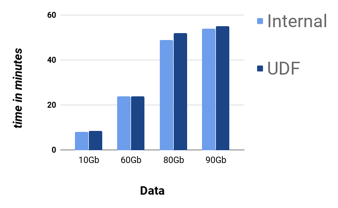
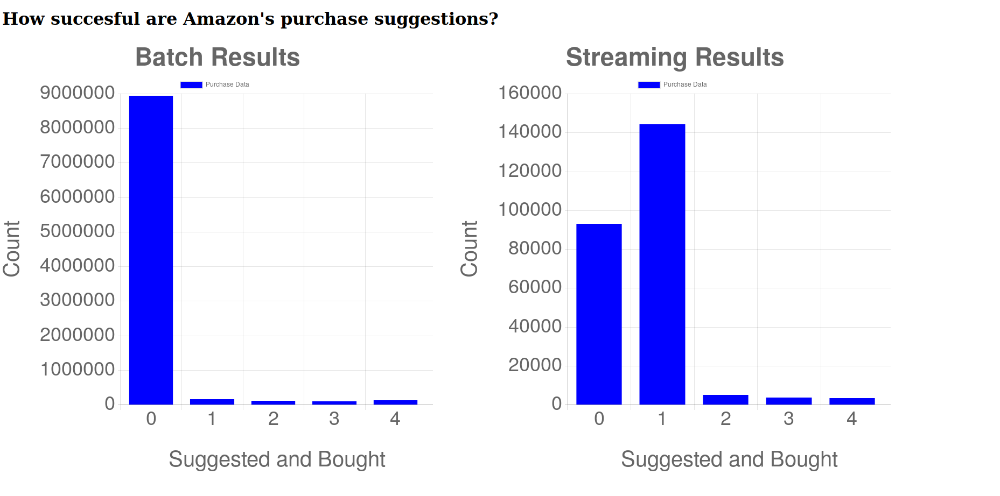

# Array modifications in SparkSQL

## Description
I implemented array modifications internally with SparkSQL and compared performance to UDFs.
See here for my modified Spark Distro: [modified-Spark](https://github.com/bastihaase/spark).
I also implemented a pipeline analyzing Amazon purchase data to test the pipeline.

This repo contains the code that was used to build the pipeline and do the performance testing.

## Internal modifications

I added internal functions in SparkSQL to compute
intersections and exclusions of arrays.
Example:
If col1 and col2 contain arrays of the same type, then

    SELECT ARRAY_INTERSECT(col1, col2) FROM TABLE

will return a column of arrays that contain the common elements of
the input arrays. Thorough unit testing is
provided and specific methods for arrays of type int, byte and long are
included to improve performance.

Most of my additions are part of the catalyst module of SparkSQL.
Essentially, catalyst decomposes SparkSQL statements as trees, optimizes
the execution plan and ultimately produces JVM bytecode.

My modifications are based on the branch of [Kiszk' Spark.](https://github.com/kiszk/spark).

## Use-case

### Abstract use-case

If a company is heavily commited to a framework, they might face the dilemma
that a new use-case is not covered by the current framework. They can then
either implement the function internally or switch the framework. If they
implement the function internally, they can either dive deep into the source code
(if the framework is open source) or build a layer on top of the framework that
adds the desired functionality.

More specifically, a company heavily invested in SparkSQL might face the issue
that arrays functionality is very limited. There are (at least) three possible ways
to get around this

- implement it internally
- use user-defined functions (UDFs)
- use Spark

The last two options have the disadvantage that they require non-SQL code. Maybe
many analysts in the company do not have a strong enough background in
Scala/Java/Python background to use those. Additionally, UDFs are not as tightly
integrated in the optimization process that Spark provides so performance might
suffer.

An internal implementation circumvents these issues. As usual, it comes with its
own trade-offs. It might be more costly to develop, maintain and upgrade.
Also, the performance advantage is hard to predict.

The goal of my project was to implement array functionality internally and
compare it to UDFs to get a better understanding of the performance disadvantage
of UDFs.

### Concrete use-case and pipeline

Imagine you are batch-processing or streaming purchase data from a website like Amazon.
With every purchase, you have a JSON object that contains (among other things)
two arrays:

- other products shown by Amazon  after the purchase
- other products actually bought after this purchase

A first indicator to determine the effectiveness of the suggestion algorithm is
to compute how many products that were shown by Amazon were also bought.
This is where one wants to compute the intersection of two arrays.

To implement a full pipeline demonstrating this feature, I designed
the following system:

- load metadata from HDFS into SparkSQL
- batch-process metadata and store them ordered by number of intersections in a MySQL database
- output a dashboard using Flask that shows statistics

The dataflow can be described as follows:

## Dataset

The dataset is based on Amazon purchase data. For performance testing,
this dataset was used to create larger simulated files.

## Engineering Challenges

The main challenges encountered in this project were:

- Understand how SparkSQL works internally
- SparkSQL uses a tree of expressions to parse SQL commands to Spark jobs
- The catalyst component compiles SQL commands to JVM bytecode based on these rules
- There is no detailed documentation for this, so I dove deep into the source code
- Specifically, I chose specific SQL commands and analyzed how they were parsed
- Setting up a fully functioning data pipeline was a secondary engineering challenge

## Results

### Performance Comparison

 I compared performance on a AWS cluster with two m4.Large worker nodes with 8Gb Ram each.
 When testing for performance, I excluded all external bottlenecks such as storing the
 results in the MySQL database.

 Results for an isolated usage of
     ARRAY_INTERSECTION

 ### Amazon Purchase data statistics

 Using my internal functions, I was able to analyze how effective Amazon's prediction is.
 Here is the output of my Flask app:

We can see that the vast majority of buyers do not buy other items suggested by Amazon.
